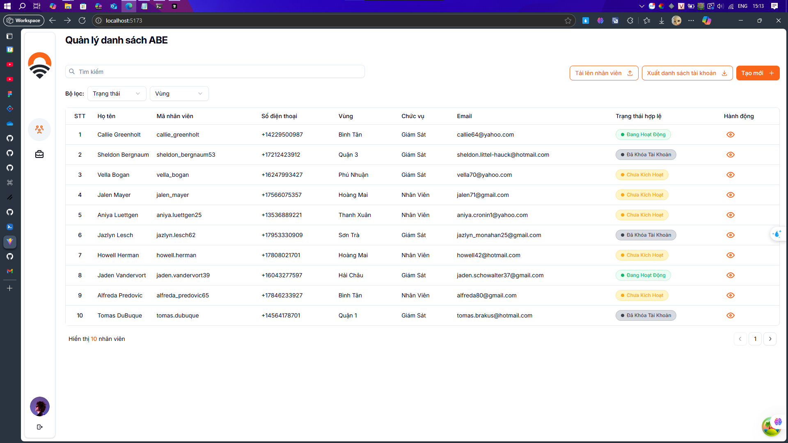

# drdigital
   
## Getting Started

Follow these steps to set up and run the project locally:

### Prerequisites
- **Node.js v22.x** (required)
- **Yarn** (recommended package manager)

### 1. Clone the Repository

```bash
git clone https://github.com/DiiKhanh/drdigital.git
cd drdigital
```

### 2. Install Dependencies

```bash
yarn install
```

### 3. Start the Development Server

```bash
yarn dev
```

This will start the Vite development server. Open your browser and navigate to the URL shown in the terminal (usually http://localhost:5173).

### 4. Build for Production

To build the project for production:

```bash
yarn build
```

### 5. Preview the Production Build

```bash
yarn preview
```

---

## Tech Stack
- **React**
- **Vite**
- **Node.js v22**
- **Yarn**

## Notes
- Make sure you are using Node.js v22.x for compatibility.
- If you do not have Yarn installed, you can install it globally with:
  ```bash
  npm install -g yarn
  ```
- For any issues, please check the repository issues or open a new one.
